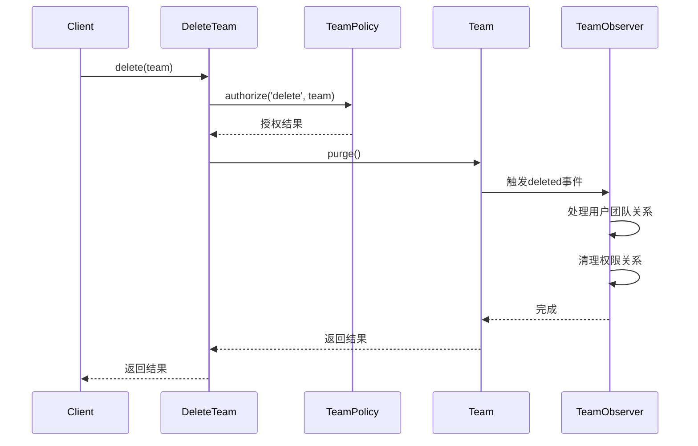

# 团队删除功能实现指南

本文档详细说明了MES系统中团队删除功能的业务规则、实现机制和使用方法，帮助开发人员理解和维护相关代码。

## 1. 功能概述

在多团队权限系统中，团队删除是一项需要谨慎处理的操作，涉及到用户关系、权限调整、数据迁移等多方面内容。本功能实现了完整的团队删除流程，包括软删除和强制删除两种模式。

## 2. 业务规则

### 2.1 基本规则

- **特殊团队保护**：系统默认的`admin`团队(ID=1)和`default`团队(ID=2)不允许被删除
- **权限控制**：只有超级管理员和拥有`teams.delete`权限的用户可以删除团队
- **强制删除限制**：只有超级管理员可以执行团队的强制删除操作

### 2.2 用户团队切换

当团队被删除时，系统将按照以下规则处理用户的当前团队：

1. 对于"**仅属于被删除团队**"的用户：
   - 自动将其`current_team_id`切换到系统的默认团队(`default` 团队，ID=2)
   - 确保用户始终有一个有效的团队上下文

2. 对于"**同时属于多个团队**"的用户：
   - 保持其原有的`current_team_id`不变
   - 如果原`current_team_id`就是被删除的团队，则不调整

### 2.3 权限与角色关系处理

删除团队时，系统将清理与该团队相关的所有权限数据：

1. 删除`model_has_roles`表中属于该团队的所有记录
2. 删除`model_has_permissions`表中属于该团队的所有记录

> **注意**：团队删除不会删除角色和权限本身，只清理用户与角色/权限的关联关系。

### 2.4 软删除与强制删除

系统支持两种删除模式，处理逻辑有所不同：

#### 软删除模式
- 团队记录被标记为已删除(`deleted_at`字段设置为当前时间)
- 团队成员关系(`team_user`表)被软删除
- 团队邀请(`team_invitations`表)被软删除
- 清理与团队相关的权限和角色关系

#### 强制删除模式
- 团队记录被永久删除
- 所有团队成员关系被永久删除
- 所有团队邀请记录被永久删除
- 清理与团队相关的权限和角色关系
- 删除团队相关的日志和其他关联数据

## 3. 代码架构

团队删除功能的实现基于以下几个关键组件：

### 3.1 核心类

- **`Team` 模型**：团队模型类，包含`purge()`和`forceRemove()`方法
- **`TeamObserver`**：团队观察者类，监听团队的生命周期事件
- **`DeleteTeam` Action**：Jetstream团队删除动作类
- **`TeamPolicy`**：团队操作的权限策略类

### 3.2 实现机制

团队删除功能采用**观察者模式**结合**事件驱动**的方式实现：

1. 当调用`Team::purge()`时，触发软删除流程
2. 当调用`Team::forceRemove()`时，触发强制删除流程
3. `TeamObserver`监听`deleting`、`deleted`和`forceDeleted`等事件，执行相应的业务逻辑
4. `TeamPolicy`控制用户的删除权限

### 3.3 关键流程



## 4. 代码示例

### 4.1 删除团队

```php
// 通过Action删除团队(推荐方式)
$deleteAction = new \App\Actions\Jetstream\DeleteTeam();
$deleteAction->delete($team);

// 或直接调用模型方法
$team->purge(); // 软删除
$team->forceRemove(); // 强制删除
```

### 4.2 权限判断

```php
// 检查是否可以删除团队
if (Gate::allows('delete', $team)) {
    // 可以删除
}

// 检查是否可以强制删除团队
if (Gate::allows('forceDelete', $team)) {
    // 可以强制删除
}
```

## 5. 常见问题

### 5.1 删除特殊团队

如果尝试删除特殊团队(`admin`或`default`)，系统将阻止操作并记录警告日志。

```php
// 在TeamObserver::deleting方法中
if (TeamConstants::isSpecialTeam($team->id)) {
    Log::channel('security')->warning('尝试删除特殊团队被阻止', [
        'team_id' => $team->id,
        'team_name' => $team->name,
        'user_id' => auth()->id() ?? null
    ]);
    
    return false;
}
```

### 5.2 团队恢复

团队被软删除后，可以通过`restore()`方法恢复：

```php
$team = Team::withTrashed()->find($id);
$team->restore();
```

恢复时，`TeamObserver::restored`方法会自动恢复相关的成员关系和邀请。

## 6. 测试

团队删除功能有完整的测试覆盖，测试文件位于`tests/Feature/DeleteTeamBehaviorTest.php`。测试验证以下场景：

1. 用户只属于待删除团队时的自动团队切换
2. 删除团队后权限和角色关系的清理
3. 强制删除时关联数据的处理
4. 权限策略的正确执行

## 7. 性能考虑

- 使用缓存存储默认团队ID，减少查询数据库
- 使用事务确保数据一致性
- 使用批量操作处理大量数据

## 8. 安全考虑

- 严格的权限控制，只有授权用户可以删除团队
- 特殊团队保护机制
- 完整的日志记录，跟踪所有删除操作
- 使用软删除作为默认方式，降低误操作风险

## 9. 相关文件

- `app/Models/Team.php`
- `app/Observers/TeamObserver.php`
- `app/Actions/Jetstream/DeleteTeam.php`
- `app/Policies/TeamPolicy.php`
- `app/Helpers/TeamConstants.php`
- `app/Helpers/PermissionHelper.php`

## 10. 扩展与维护

如需扩展团队删除功能，建议在以下方面进行：

1. 在`TeamObserver`中添加更多关联数据的处理
2. 扩展日志和通知机制
3. 添加更细粒度的权限控制

修改现有功能时，请确保同步更新测试用例，维持完整的测试覆盖。 